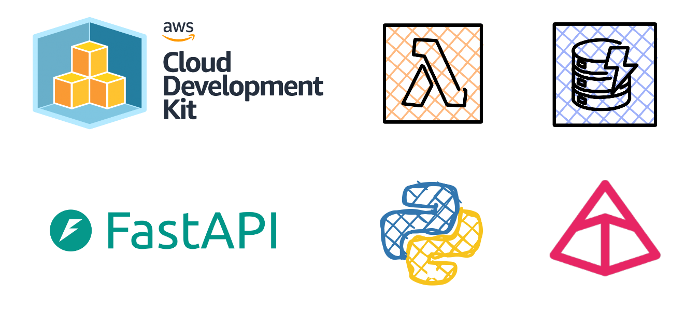

## Player FC FastAPI App

This repository provides a simple Player API that uses FastAPI, DynamoDB and hosted on AWS Lambda.

For detailed information, visit the below bog post series:

[Serverless FastAPI Development: Building Player FC API on AWS](https://adrianthegreat.com/2025/01/06/Serverless-FastAPI-Development-Building-Player-FC-API-on-AWS/)

[Serverless FastAPI Testing: Use Moto and Just Mock It!](https://adrianthegreat.com/2025/06/21/Serverless-FastAPI-Testing-Use-Moto-and-Just-Mock-It/)

[Serverless FastAPI Security: Unlocked Doors Invite Unwanted Guests](https://adrianthegreat.com/2025/07/12/Serverless-FastAPI-Security-Unlocked-Doors-Invite-Unwanted-Guests/)

